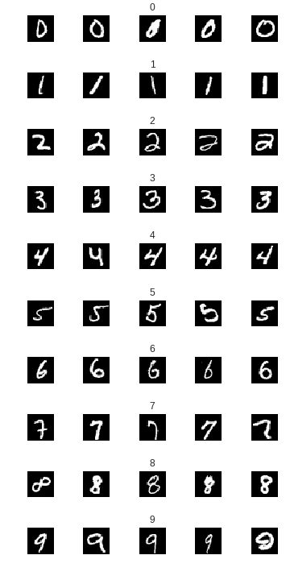
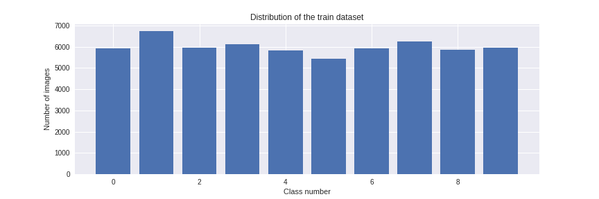
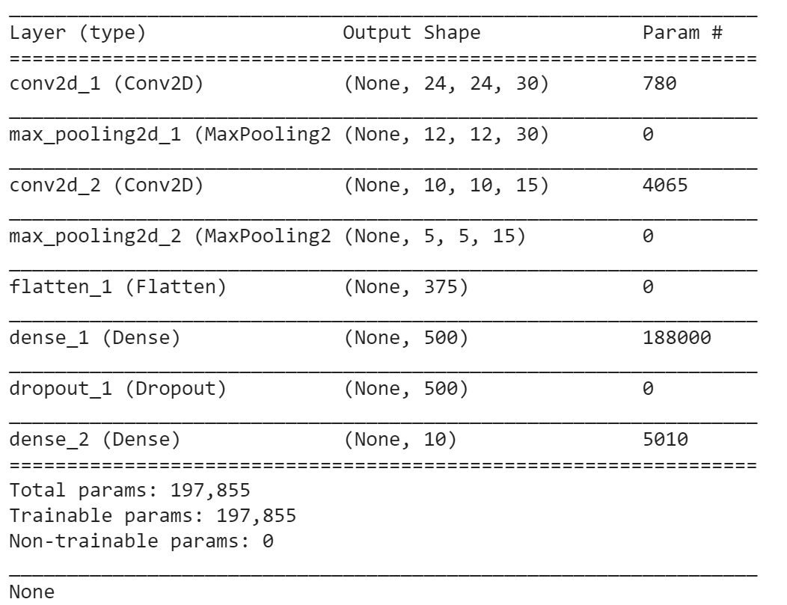
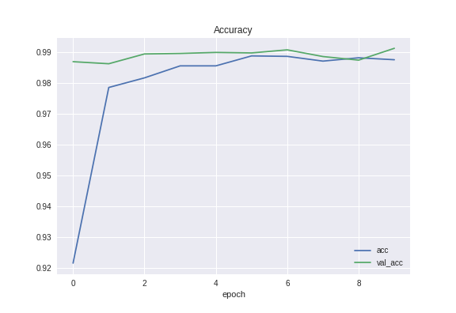
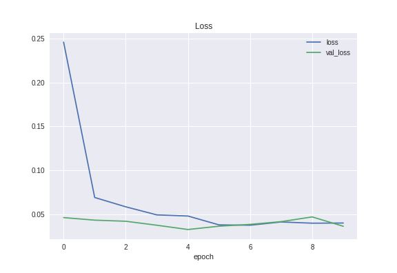
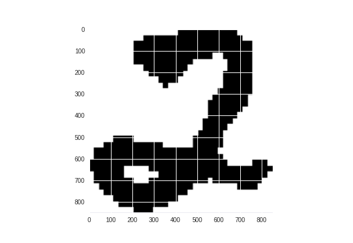
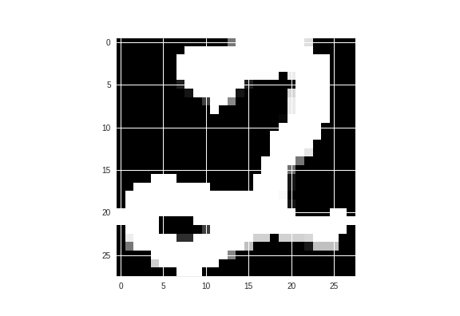
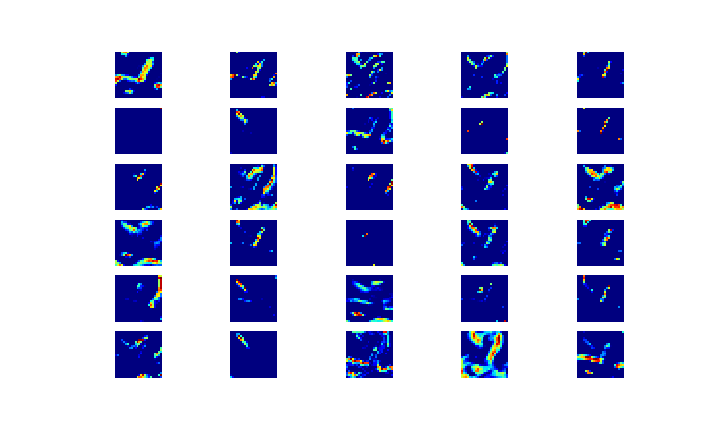
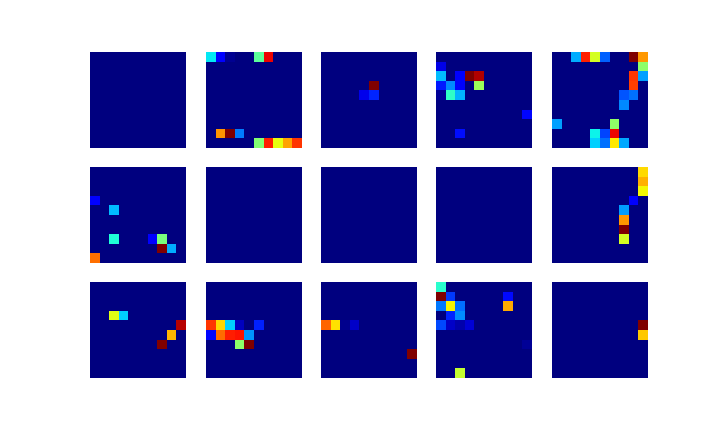

# deep_learning
Classify images of handwritten digits with a LeNet Convolutional Neural Network and a Deep Neural Network

This repository contains 2 Python files that both:

* Import images of handwritten digits from MNIST

* Train a neural network using KERAS to classify the images

The difference is that `Convolutional_Neural_Network.ipynb` uses convolutional neural networks to train the model. `mnist_deep_learning.py` uses a Deep Neural Network to achieve the same goal, but has a lower accuracy on test data. 

## Convolutional_Neural_Network.ipynb

### Setup

The first step was to import 60,000 labelled images of handwritten digits from the mnist dataset. 

__Figure 1: Subset of Training Data__

__Figure 2: Dataset Distribution__

__Figure 3: LeNet Model Summary__

### Result

The model resulted in a __98.75%__ training accuracy and __99.12%__ validation accuracy.

__Figure 4: Accuracy and Loss Plots of Training and Validation Data__

We then tested the model on numerous unseen test images found online, all of which passed. Below is an example of a handwritten image of the number 2, which was successfully classified by the model.

__Figure 5: Example of Unseen Test Image__  

### Visualization of Layers

## How To Run
You can run `Convolutional_Neural_Network.ipynb` on Google Colab. It is best to press `Runtime`> `Change runtime type` > `Hardware Accelerator` > `GPU` to improve the runtime signficantly.
